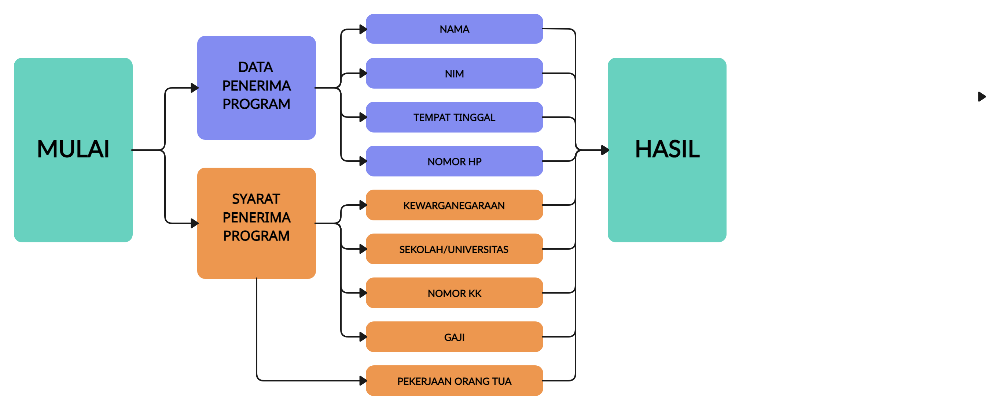

## PROGRAM BANTUAN BANSOS

# STUDI KASUS
Banyak anak di daerah perkotaan mengalami masalah kekurangan gizi karena keterbatasan ekonomi. Makan siang yang sehat dan bergizi sangat penting untuk mendukung pertumbuhan dan perkembangan anak. Program makan siang gratis di sekolah bertujuan untuk memastikan semua siswa mendapatkan makanan yang layak.

Program harus menerima input berupa :

Data Pribadi
1. Nama
2. Nim
3. Tempat Tinggal
4. No handphone
5. pekerjaan orang tua

Syarat Kelengkapan
1. Kewarganegaraan
2. Sekolah atau universitas
3. Nomor NIM
4. NO.KK

Kriteria
1. Siswa atau Mahasiswa Aktif
2. Harus WNI
3. Yang tidak bisa mendapat Program (Tni, ASN, Polri)
4. Gaji harus <= 2000000

Jika Siswa/Mahasiswa memenuhi kriteria, maka program akan mencetak nama, nim, tempat tinggal, no hp, dan hasil bahwa warga tersebut mendaoatkan Bansos. jika tidak, program akan mencetak pesan yang sesuai

## FLOWCART
